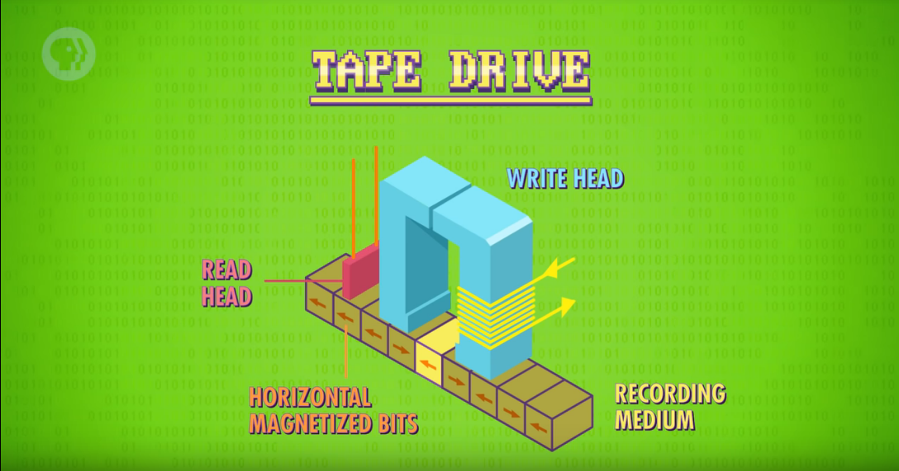
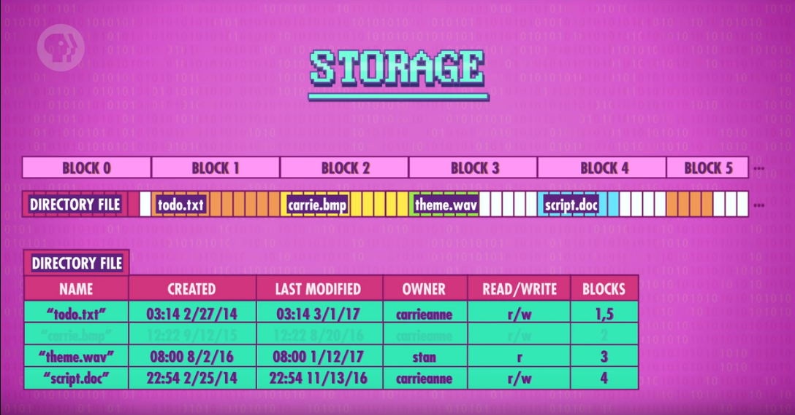
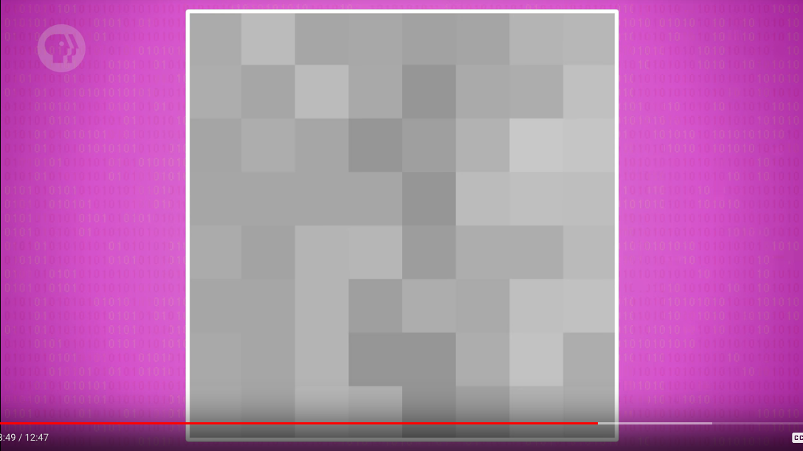

Scanning# #1
Quick brief about pre-electronic devices and how they relate with computing. Historical overview.

# #2
Technical brief: first computer with switch gates with moving part, vacuum tubes as switch without moving parts, switches based on semiconductors - transistors.

# #3
Overview to boolean algebra: NOT, OR and AND gates. Technical implementation of this gates with transistors. NOR gates. All what we have is this: 0 or 1.

# #4
How computers store and represents numerical data.
Sing bit: 0 for positive, 1 for negative.

**Floating point numbers**:
- Most common method of representing such numbers is IEEE 754 standard (scientific notation: 0.314 * 10^1).
- In 32-bit floating number:
	1. First bit for sing;
	2. Next 8 bits for exponent (power of 10);
	3. Remaining 23 bits for significant (.314 in our case).

All in computer is binary digits - bits.

# #5
ALU - Arithmetic and Logic Unit.
ALU - mathematical brain of a computer.

###Arithmetic unit:
- responsable for handling all numerical operations in a computer(addition, subtraction)
- **Half adder**:
	1. two inputs: A and B;
	2. two gates: XOR and AND;
	3. XOR gates: (!A * B) + (A * !B) - for SUM, or first value of first bit;
	4. AND gates for CARRY, or value of second bit.
- **Full adder**:
	1. three inputs: A, B and C;
	2. first half adder with inputs A and B;
	3. second half adder with inputs C and SUM of first half adder;
	4. SUM of second h.a. is SUM of f.a.
	5. OR gates with two inputs: CARRY of first a. and CARRY of second a.;
	6. Output of OR gates is CARRY of f.a.
	7. For more check the "8-bit ripple carry adder", "carry-look-ahead adder".

##### Functionality of ALU:


##### ALU abstraction:


# #6 Register and RAM

*RAM* - stores things as long as the power stays on.
*Persistent memory* - can store things without power.

### AND-OR latch
(SET + (SET * !RESET)) * !RESET

In abstraction: latch have two inputs (SET and WRITE) and one output (DATA OUT). I think that boolean expression is one of this: SET * WRITE - but latch is remembered its state.

### Register
Is a group of latches which holds a single number. Number of bits in *register* is called its width. (width of register is the same as width of *word*)

### Latch matrix
For optimisation and minimize number of wires and access to memory they create matrix of latches. For example if we have 4 * 4 latch matrix then we have 4 y-parellel wires and 4 x-parellel wires. y-parallel wires are WRITE input, x is SET input.


### Multiplexer
For navigation and latch request in latch-matrix.


### Memory abstraction


# #7 The CPU
... job is for executing programs.
Programs are made up of a series of individual operations, called instructions.

> High level view is called Microarchitecture

### Instruction table
where we can assign an ID to each instruction supported by our CPU.


### Registers
are used to temporarily store and manipulate values.

1. Instruction address register - keep track of where we are in program. Stores **the memory address** of current instruction.
2. Instruction register - store the current instruction itself.

When we first boot up our computer, all of our registers start at 0 - *FETCH PHASE* (phase where we receive CPU's first instruction).
We wire our I.A. register to RAM. The register value is 0, so the RAM returns whatever value is stored in address 0.
In our RAM value in address 0 is 0010_1110 - this value is copied into I. register.

*DECODE PHASE* - we fetch an instruction from memory and need to figure out what that instruction is, so we can **execute it**.

Value of I. register is 0010_1110. 0010 is the *opcode* - first four bits. This opcode corresponds to the "LOAD A" instruction which loads the value from RAM into register A. 1110 - last four bits - is the RAM address, value from which we need to LOAD in A register.

1. Instructions are decoded and interpreted by a Control Unit.
2. Now that we know what instruction we're dealing with, we can go ahead and perform it, which is the beginning of *EXECUTE PHASE*.
3. Using the output of operation of figure out the instruction, we can now get access to RAM (turns on READ ENABLE wire).
4. Send the 1110 address to RAM.
5. Retrieve the value from RAM, which is 0000_0011.
6. We execute the "LOAD A" instruction and need save 0000_0011 to the A register.


7. Now when we completed the instruction, we can turn off all of the wires:


### Control Unit Abstraction

> As I notice, after executing the 0010 instruction (I.A. register's value is 0) we increment value of I.A. register by 1.


Now I.A. register value is 1, or 0000_0001.

##### FETCH PHASE:
1. The Control Unit turn on Address Input and Read Enable wires.
2. Request the value of 0000_0001 memory address in RAM.
3. Receive the value of this address which is 0001_1111

##### DECODE PHASE:
4. 0001 - "LOAD B" instruction - moves a value from RAM intro register B.
5. Memory location in this time is 1111.

##### EXECUTE PHASE:
6. The C.U. turn on Address Input and Read Enable wires.
7. Request the value of 1111 memory address in RAM.
8. Configure register B to receive that data: turn on WRITE wire into B. register.
9. Register B. receive the data from RAM through DATA output wire of RAM.
10. Increment I.A. register value by 1.
11. Turn off all wires.

### ADD Instruction.


1. Fetch value of 0000_0010 address from RAM.
2. Put value of this address (1000_0100) to I. register.
3. The opcode 1000 is an **ADD** instruction
4. 0100 in this instruction is 2 2-bit register ID (01 is ID of B register, 00 is ID of A register).
5. So 1000_01_00 is the instruction for adding the value in Register B into the value in register A.
6. For this type of Instruction wee ned ALU.
7. The C.U. is responsible for selecting the right registers and pass them as inputs to ALU.
8. The Control Unit pass values of register A and B by turn on wires into 2 inputs of ALU.
9. The Control Unit pass opcode of instruction (ADD: 1000) to input "operation code" of ALU.
10. The ALU output should be save into Register A. But it can't be written directly "because the new value would ripple back into the ALU and the keep the adding to itself".
11. So the C.U. uses an internal register to temporarily save the output, *turn off* the ALU, and the write the value into the proper destination register (A).
12. Increment the value of I.A. register by 1.
13. Turn off all wires.

### STORE_A operation:
1. Instead of turn on the READ wire to RAM, the C.U. turn on the WRITE wire in RAM.
2. Value from register A is retrieve by DATA wire to RAM.
3. 0100_1101:
- opcode is 0100 - STORE_A;
- 1101 is memory address in RAM in which we need to store.

### The CLOCK
- have the responsibility of keeping the CPU ticking along falls to a component called the clock.
- triggers an electrical signal at a precise and regular interval.

**Clock speed** - the speed at which a CPU can carry out each step of the fetch-decode-execute cycle. This speed is measured in Hertz - a unit of frequency.

**Q**: is one tick of the clock is one instruction?

**A**: Probably yes.

# #8 Instructions & Programs

CPU is *programmable* - if you write the certain sequence of instructions then the CPU will perform them

> So the CPU is a piece of **hardware** witch is controlled by easy-to-modify **software**

Notice: "opcode" - operation code.

### JUMP Instruction:
Update instruction address register to new address (i.e. jump to address). This is useful if we want change or skip the order of instructions.
For example:
**JUMP 0**, would cause the program to go back to the beginning. Because *it sets the value of I.A. register to 0*.

> Also JUMP_NEG instruction is exist.

### HALT Instruction:
computers need to be told when to stop processing, so we need a HALT instruction.

| Address        | DATA           |
| :------------- | :------------- |
| 0              | LOAD_A 14      |
| 1              | LOAD_b 15      |
| 2              | ADD B A        |
| 3              | STORE_A 13     |
| 4              | JUMP 2         |
| 5              | HALT           |
| ...            | ...            |
| 13             | 0              |
| 14             | 1              |
| 15             | 1              |

- this sequence of instructions is called "*infinite loop*".
- to quit this loops we need JUMP with condition - JUMP_NEG. Notice that computers also have: JUMP_IF_EQUAL, JUMP_IF_GREATER.

In our CPU, where register width is 1 byte, we can fetch only 16 instructions and only 16 memory addresses. To expand this numbers, CPUs use two strategies:
1. And here I lost the point of video. What is *instruction length* and *variable length instructions*. Didn't clear understand that part.

# #9 Advanced CPU Designs

When CPU executes our division-operation program (implemented by JUMP_NEG) it got a sequence of subtractions which operations too and execute in particularly order: one by one. Such method is required a lot of clock cycle and isn't perfectly efficient.

**Quote**: ... modern computer processors now have special circuits for things like graphics operations, decoding compressed video, and encrypted files - all of which are operations that would take many clock cycles to perform with standard operations.

**Q**: Backwards Compatibility?

**A**: is a property of a system, product, or technology that allows for interoperability with an older legacy system, or with input designed for such a system, especially in telecommunications and computing.

> Intel 4004 Instruction set have 46 instructions.
> But a modern computer processor has thousands of different instructions.

### Problem of fast CPUs and slow RAMs

RAM is lies outside of CPU. Electric signal from CPU to RAM goes through the BUS (wires which connect RAM and CPU). Speed of electric signal is limited and when we talks about GigaHz this comes to acting. RAM doesn't have time for CPU (CPU is to fast).
So in terms of this, the load data from RAM might take dozens of clock cycles to complete, and during this time the CPU is just sitting there idly waiting for the data.
One of the solution of this is to put piece of RAM inside CPU - *cache*.

### How cache works

**Q**: by what criterion we choose the memory to store in cache?

Regarding to video the memory in RAM is divided by blocks and sure, when you need access to several memory address you will get it. Blocks are like 0-100/ 100-200/ 200-300 etc. memory addresses. When CPU request the several memory address from RAM, it get the hole block in which this memory address is located.

> Because the cache is so close to the processor it can typically provide the data in a single clock cycle.

> When data requested in RAM is already stored in the cache like this it's called **CACHE HIT** (alternatively cache miss)

**Q**: We has some memory in CACHE, in other words it's copied memory from RAM. After one clock cycle memory in RAM can be change or updated. *How can we be sure for relevance of memory in CACHE?*

**A**:
> The mismatch has to be recorded, so that at some point everything can get synced up. For this purpose, the cache has a special flag for each block of memory it stores, called **DIRTY BIT**.
> Before the *cache erases* (стирает) the old block to free up space, it checks its dirty bit, and if it's dirty, the old block of data is written back to RAM before loading in the new block.

**FORM WIKI**:
A dirty bit or modified bit is a bit that is associated with a block of computer memory and indicates whether or not the corresponding block of memory has been modified. The dirty bit is set when the processor writes to (modifies) this memory. The bit indicates that its *associated block of memory has been modified and has not been saved to storage yet*. When a block of memory is to be replaced, its corresponding dirty bit is checked to see if the block needs to be written back to secondary memory (**RAM**) before being replaced or if it can simply be removed. Dirty bits are used by the **CPU cache** and in the page replacement algorithms of an operating system.

**FROM MY HEAD**:
If the dirty bit has been setted, then this block of memory has been modified regarding to value of its source. In other words:
+ we copy block of memory from RAM to CPU's cache.
+ we modify that block in cache.
+ hence, the source of this block in RAM doesn't be modified.
+ we set the dirty bit of this memory block in CPU's cache for indicate that this block has been modified and need to update the value of this block in RAM (source) too.
+ updating the value in RAM and replace its from cache.

If dirty bit doesn't setted, then we can just replace this block of memory from CPU's cache because it's identical to the source block of memory in RAM.

Didn't clear understand this at all.

**INSTRUCTION PIPELINING**:
*Parallelizing* our operations.


**Q**: OUT-OF-ORDER EXECUTION and CONDITIONAL JUMP INSTRUCTIONS? Problems with **INSTRUCTION PIPELINING**.
**A**: C.J.Instruction can change the execution flow (pipeline) of a program depending on a value.
> Imagine an upcoming jump instruction as a fork in a road - a **branch**. Advanced CPUs guess which way they are going to go, and start filling their pipeline with instructions based off that guess - a technique called **speculative execution**.
1. when the JUMP instruction is finally resolved, if the CPU **guessed correctly**, then the pipeline is already full of the correct instructions and it can motor along without delay.
2. However, if the CPU **guessed wrong**, it has to discard all its speculative results and perform a **PIPELINE FLUSH** - sort of like when you miss a turn and have to do a u-turn to get back on route.
- To minimize the effect of these flushes, CPU manufactures have developed sophisticated ways to guess which way will go, called **BRANCH PREDICTION**. (today's CPUs can often guess with over 90% accuracy, instead of 50/50).

Pipelining lets you completed one instruction every single clock cycle, in other words it's possible to perform FETCH, DECODE and EXECUTE in one clock cycle.

**Q**: but wait, one INSTRUCTION per clock cycle? Then how can we manage when to perform phases (F./D./E.)? Upon receipt?

**A**:

| Clock cycle | Phase     |
| :------------- | :------------- |
| 1       | FETCH       |
| 2              | DECODE/FETCH         |
| 3              | EXECUTE/DECODE/FETCH |
| 4              | EXECUTE/DECODE/FETCH |

So in previous images, the number of clock cycle is the value of x-axis, and yes one phase per clock cycle but with **INSTRUCTION PIPELINING** it performs to one INSTRUCTION at third cycle.

**SUPERSCALAR** processors came along which can execute more than one instruction per clock cycle. Such processors are named this, because "we can add duplicate circuitry for popular instructions." and "... many processors will have 4, 8 or more identical ALUs".


> ... another way to increase performance is to run several streams of instructions at once with **multi-core** processors.


Dual-core or Quad-core processors - these means there are multiple independent processing units inside of a single CPU chip. In many ways it's like having multiple separate CPUs, but because they're tightly integrated, they can share some resources, lick cache, allowing the cores working together on shared computations.

**SUPERCOMPUTERS** much more than just single quad-core processor.

**FLOPS** - floating point math operations per second.

# #10 Early Programming

Weaving machines, punch cards, population census and HOLLERITH 1890 tabulating machine.

Early programming is about tell the computer what you want and give him sum necessary data. At that ages (~1940) computer already has the memory inside. Programming the computer is about using existing instructions of that computer via punch cards.

62_500 punch cards is about 5 MB - US Air Force's SAGE air defense system.

The result of computations is returning via punch cards too.

And there is inventing the **PANEL PROGRAMMING** - not via punch cards but with huge panel with switches (ON/OFF)

# #11 The First Programming Languages

`LOAD_A 1110` <=> "Load address 14 into register A"

Computers able to speak only one language - machine language or machine code.

At times, when programmers could write programs only on *machine code*, first they write the program on english (sort of high-level description of future program, which will be writing on machine code). Such high-level description is called **PSEUDO-CODE**.

So writing on pure machine code was awesome, but at 1950 programmers had developed slightly higher-level languages that were more human-readable. **OPCODES** were given simple names, called **mnemonics** which were followed by **operands**, to from instructions. Instead of writing 0s and 1s, they now can write `LOAD_A 1110`.

Computers can't understand `LOAD_A 1110`, they can understand only machine code. For this were invented programs, which can read in text-based instructions and assemble them to machine code (corresponding instructions in binary). This programs is called an **ASSEMBLER**. It read in a program written in assembly language and converts it to native machine code.

Assembler could have to solve the problem with `JUMP N` and adding more instructions to memory. After last operation, the memory location N is no more what we expected - it is different location now. So we need to rewrite `N` to `N + added_instructions_count`

So in an assembler there is no such "raw jump instructions". Instead it provide us a "labels", such `LOOP N` and `DONE`.

HARVARD MARK 1 - the computer from 1940 was programmable via **punched paper tape** . The MARK 1's instructions were so primitive, there weren't even `JUMP N` instruction. So if you need to make loop, you need to tape two ends of the punch tape together - creating a physically loop. For avoid this in future computers were invented first high-level programming language called "Arithmetic Language Version 0" (A-0).

> Assembly languages have direct, **one-to-one mapping to machine instructions**. But, a single line of a high-level programming language might result in dozens of instructions being executed by the CPU.

To perform this complex translation, Hopper built the **first compiler** in 1952. The point is, that programming language source code can be transformed to into low-level language (assembly) or even pure (binary) machine code.

> Thanks to these languages, computing went from a cumbersome and esoteric discipline to a general purpose and accessible tool.

> Нужно выбирать: либо супер быстрому компьютеру выполнять больше работы (компиляция и т.п.) либо не очень быстрому человеку писать на чистом машинном коде.

# #12 Programming Basics

> The set of rules that govern the structure and composition of statement in a language is called **syntax**. The English language has syntax, and so do all programming languages.

# #13 Algorithms -
specific steps used to complete the computation

**SORTING**:
+ Bubble sort
+ Spaghetti sort
+ and much more

**SELECTION SORT**:
```swift
var smallestItem = array[0]

for index in array.indices {
	for item in (index+1)...array
}

```

**MERGE SORT** - O(N * logN)

**GRAPH SEARCH**:
+ Brute Force Approach  - O(N!)
+ Dijkstra's algorithm - O(N^2)
+ Improved Dijkstra's algorithm - O(N * logN + 1)

# #14 Data Structures

**NODE**:
```
STRUCT node {
	VARIABLE i
	POINTER next
}
```
Using **NODE** we can create a **linked list**:


+ *memory address 1000 is `i` and 1001 is `next` etc.*
+ *this linked list is CIRCULAR*


- Unlike an array, which size has to be pre-defined, *linked list* can be dynamically extended or shortened.

... many more-complex data structures are built on top of linked lists. For example **QUEUES** and **STACKS**.

**Q**: so array is linked list too?

**A**: no, array isn't a linked list. I think it is easy to understand.
**TREES**:
```
STRUCT node {
	VARIABLE i
	POINTER nextLeft
	POINTER nextRight
}
```

**Q**: difference between **TREES** and **GRAPHS**.

# #15 Alan Turing

**DECISION PROBLEM**:
Is there an **algorithm** that takes, as input, a **statement written in formal logic**, and produces a **"YES" or "NO" answer that's always accurate**?

If such algorithm is existed, then we can question him questions like "is there a number that bigger then all numbers?"

**Note**: such universal algorithm which can answer any question.

**Alonzo Church**: invented **lambda calculus** and demonstrated that no such universal algorithm could exist.

## Turing Machine -
1. provide a simple powerful mathematical **module of computations**. Although using totally different mathematics, they were **functionality equivalent to lambda calculus** in terms of their **computation power**.

2. is a theoretical computing device equipped with an infinitely long memory tape which stores symbols and a device called READ/WRITE head which can read and write, or modify symbols on that tape.


*after computations the tape configurations is will be: 111*

Turing show that this simple hypothetical machine *can perform any computation* if given enough time and memory.
**Notice**: we can change rules.

... there's no more powerful machine than a Turing machine. A computer that is as powerful is called **Turing complete**.

**HALTING PROBLEM**:
Is there an algorithm that can determine, given a description of a turing machine and the input from its tape, **whether the Machine will run forever or halt**?

Turing machine with such rules as in ScreenShot above will halt with given input 110.

Unfortunately turing came up with a proof that shows **the halting problem was in fact unsolvable**, through a clever logical contradiction.


*if there existed a program Whose halting behavior was not decidable by this machine it would mean the halting problem is
Unsolvable*

Another time:
+ we have computer (that have name - **H**), that have two inputs:
	1. the program (the rules)
	2. the input (1 and 0 on the tape)
+ the computer answers: does the program halt on this input?
+ the output is true/false
> If there existed a program Whose halting behavior was not decidable by this machine it would mean the halting problem is
Unsolvable

+ lets create another machine which is based on **H** output
+ if **H** -> true, then new machine will loop
+ else if **H** -> false, then new machine will halts
+ something like (output **H**) = !(new machine output)
+ but here is the case: what if we put the
- so don't understand it. Some paradox is the results of all of this.

Yes, if turing machine is determined by answer any question then yes. This case is denies that.
Pass new machine as input of **H**. If **H** output is true (the new machine halt? - YES), then machine will loop forever because of (output **H**) = !(new machine output). Yes this is the paradox, and this is the question on which turing machine can't answer.

# #16 Software engineering

IDE - Integrated Development Enviroments

# #17 Integrated circuits & Moore's law

The problem of early computers is big details (vacuum tubes, at some ages event mechanical switches) and tyranny of numbers because of discrete details. At computer rise, there is only discrete part of computer: discrete transistor with 3 wires, discrete vacuum tube and so on.

The solving of this problem is integration this discrete components into one component (integrated circuits - ICs)

But engineers can't create such big integrated component for performing all tasks, which is deal with computer - there is discrete integrated circuits. For this engineers create Printed Circuit Boards. Instead of wires, there is a:


Nice illustration of photolitography.

At present, the integrated circuits are so small, then quantum mechanics is come at part.

# #18 Operating System
- just a programms, which have special privelegies on the hardware that allows it to run and managed other programms.

At early days of computer's era, they were slow, the programm executiong might take hours, days or weaks. Also the programm itself were witten on punch cards, and programmer need to provide that stack of punch cards to computer. So computers were slow, and delivery of programms was slow too.

Computers became faster and faster, so there was a problem. Human could no longer manage the programs becuase this will be time wasting. Inserting stack of punch cards into computer was taking longer time than running actual program themselves.

The way to resolve this was the way, in which computers are operate themselves, and so OS were born.

When computers got faster, they also got cheaper. So they were popping up all over the world. Soon people starting sharing the software, but there was a problem: when you got one type computer over the world, it's easy to write the programm for it (You now the configuration of the computer). But when you got several computers, all with the different components - it is pain for writing one programm for all of these. For instance, computers can have the same CPU, but not the same printer and you need to write special code for printer for each computer with different printer. This was a huge pain for programmers.

**PERIPHERALS** - all devices connected to a computer.

Operating with p. at these days were low-level and clearly terrible, because there can be many types of p., and when you write and test code for p. 1, you can't be 100% sure that you code will run at p. 2 - this was a huge problem with software sharing.

To resolve it, OS were implemented as intermediaries between software programs and hardware peripherals.

OSs provide a software abstraction, though APIs, called device drivers.

**Atlas supervisor** - the OS for super computer, which allow to load programms automatically and run them at the same time. It did this through clever scheduling.

Notice, that printer is physicall device, so there was time wasting, when computer instruct printer to print something and sleep during printing. The A.S. didn't do it. In the A.S. the CPU could run calculations, while printing something, and yet another reading and writing data (all at the same time).

A.S. - multitasking OS.

### Multitasking
There was a thing. When you switch through programs (in terms of multitasking), you cannot lose data from some program. Also preferable, they don't allow to share memory. **The solutiong is to allocate each program its own block of memory.**:
Program A would get acces only for 0-999 locations of memory and program B 1000-1999 locations.

**Non-sequential** block of memory:
Consider that program asks for more memory, the OS decides to give it and now p. A can get acces to 0-999 and 2000-2999. If p. B require the same ... This is simplification for example, in real case there will be dozens of block scattered all over memory. Such situation will guarantee, that memory managment for programmer will be confusing.

**Non-sequential to sequential**:
To hide this complexity, OS **virtualize** memory locations. With **V. Memory** programs can assume their memory always starts at address 0, keeping things simple and consistens. The real (physicall) address were hidden by OS.


> this mech. allows programs to have flexible memory sizes, called **dynamic memory allocation** ...

### MEMORY PROTECTION
The v.memory also provides the term called **Isolated memory**.

Atlas had botn v. and protected memory.

One computer - many terminals - multiple users used one computer.

Multics - released in 1969. Can take 1 Megabit of computer's memory - this was a half of memory in some comps. The problem with size of Multics was with huge amount of features in it ("too much in it").

Unix - two separate parts of the OS.
1. Core functionality: memory management, multitasking, and dealing with I/O (input/output) - **Kernel**.
2. Useful tools: programs and libraries.

Unix-panic and error code recovery in Multics:


MS-DOS - Microsoft's Disk OS.

# #19 Memory & Storage

At starting of computer's era there is only one storage - punch cards.

### Largest program written on punch cards:

> The main program was stored on 62_500 punchcards, roughly equivalent to 5 MBs of data.

The punch cards were cheap, but they also were slow and non-reusable.

First analogous and solution over punch cards were **Delay Line Memory**.

+ Tube, which is filled by liquid like *Mercury*.
+ Then you put a speaker at one end and microphone at the other:


+ If we loop such thing, then we can store information in it:


> if you want to access a specific bit, you do have to wait for it to come around in the loop, what's called sequential or **cyclic-access memory**.

Random Access Memory is when we can access any bit at any time.

### Megnetic Core Memory


The material polarization is general part of it.

#### The M.C.Memory Matrix:


In such construction we could access any bit at any time, which is RAM.

When M.C.M replace D.L.M:

> Although starting at rougly 1 dollar per bit, the cost fell to around 1 cent per bit by the 1970s

### Magnetic Tape:


Note: **drum memory**

### Memory hierarchy:


In HDD we got moving parts, which is losing to analogous construction without moving parts - **SSD** (Solid State Drive).

# #20 Files and File Systems

Data in file could be non-organized and organized. Organized Files have **File Format**.

##### WAVE Files - Audio Filed

Before we'll read such .wav file, we need to get some inforamtion about it (bit rate, single track or stereo and etc).

> Data, about data, is called **Metadata**


Because sounds is all about amplitudes, and we can measure amplitudes and represent it as value, then we can store it as bits.

##### Picture Files

Picture is combination of pixels.

Pixels is a combination of three colors: red, grean and blue.

Picture files also have **metadata** such image resolution etc.

### How computers store files.

The hardware of storage (HDD, SSD, CPU Cache, RAM) is about raw binary: 0's and 1's.

In early days, when computers can perform only one computation at a time, storage were represented as a "line", in which we fill results of this computations. In other words we could store **only one thing** in such storage.

But nice way is to store more then one object (file) in storage. The only problem in such way is: how does computer know there files begin and end?

> Storage devices have no notion of files - they're just a mechanism for storging losts of bits.

To resolve this, we need to have a special file that records where other ones are located. - **Directory File**

Such Directory File often stores at the beginning of storage (beginning of line):

also length

> The Dir. File, and the maintenance of it, is an example of a vary basic **File System** - the part of an OS that manages and keep track of stored files.

#### Change file of directory:
Consider we want to change one of the files in our line. File are stand one after another and modifiyng one file implicilty force to move toward next file.


For resolve this, the modern f.s. stores files in blocks of memory



Notice in picture, that when we delete file from F.S. it remove it from Directory File, but not "clean" (deallocate) storage location of this file in memory. It will be cleaned and deallocated when computer needs to write something in that location, but until that it just seats there. - This is one of the ways, in which computers can recover deleted files.

Also notice that when file cannot being allocated in one block of memory, it will be allocated in several blocks. These block of one file could be out of order, broken up accross storage - such thing is called **Fragmentation**.

### Framentation problems:

In cycled-access storage devices Fragmentation could lead to really problems which will slow access-to-file performance in many times.
Consider that file stores in 5,8,1 and 10 blokcs and imagine how we can fetch that file from C.A.M. device. Go to 5, go to 8, go back to 1, got further to 10.

> Also notice that today files are stored not in 4, or even 10 block of memory. In reald world F.S., large files might be stored accross hundreds of blocks.

### Solution - Drfragmentation:
As i understand, the proccess of defragmentation is just compare unordered sequence of block (5, 2, 4) in ordered way (2, 3, 4).

> Flat F.S. - where all stored in one Directory. Works okay when computer only had a little bit of storage.

### Hierarchical File System

For such F.S. we need to add one filed in Directory File - **isDirectory**. This filed can be yes/no.

If isDirectory = yes, then this **path** have Directory File too.

So when we move file to another directory - it is just remove the record of this file from first directory, and add this record to final directory, we don't need to rewrite it in storage (implicitly move bits from one storage location to another - we don't need to do it).

**Q**: if moving file is such proccess, then why it took so much time?

# #21 Compression

### Lossless compression technique:
1. Reduce repeated or redundant information. - **Run Length Encoding**

> Such compression is **lossless compression**, because we don't lose anything. The decompressed data is identical to the original before compression bit for bit.

Except of BitMap, where we got repeated pixels (yelow, yelow, yelow), we just say 3(yellow).


2. Dictionary Coders

Huffman Tree Compression:


> Bot run-length compression and Dictionary Coders are **Lossless compression techniques**.

### Lossy compression technique:

We can do such compression, when we can potential loss information isn't important.

For example: the **sound**. We don't good at listen ultrasound, but good at hearing sounds with specific frequency.
More precisly, if data in music is sounds in the ultrasonic frequency - we can discard it, humans cannot hear it.

##### Perceptual Coding
- idea of discarding or reducing precision in a manner that aligns with human perception.

#### JPEG
- take advanrage of this by breaking images up int 8x8 pixels, then thowing away a lot of the high-frequency spatial data.

Before:


After:


Difference:


This is huge saving in terms of images, but can you imagine it in terms of videos. Hence videos is just sequence of images, that is a big and huge saving too.

### Video Compression

**Temporal Redundancy** - in the video, the background of scene often still the same in progress of this scene. So we don't need to re-transmit those pixels every frame of the video. We can just copy patches of data forward.

**Inter-Frame Similarity**

# #22 Keyboards & Command Line Interfaces

At early days, when computers didn't support multitasking, were slow and "big", users and programers didn't really need **interactive** i/o devices.

It changes when computers become faster, began support multitasking and user-computer interaction become process, duration of which isn't calculated in days/weeks. In other words, interaction with computers right now starting make sense. **Keyboards** become necessary.

**Q**: why QWERTY Keyboard?

**A**: Because of **switching barrier** or **switching cost**.

Note: Handwriting around 20 words/min. Frank McGurin 100 words/min on Keyboard.

##### Teletype machine
- electromechanically-augmented typewriters that could send and recieve text over telegraph lines.

# #23 Screens & 2D Graphics

The most earliest screens were Cathode Ray Tubes (**CRTs**).

Electrons are "pushed" to a screen and there is luminescence. We can manipulate trajectory of electrons and "paint" somethings in this way. We can do it with e.m. field and here are 2 ways to doing it:
1. Direct the electron beam to trace out shapes. - **Vector Scanning**
2. Scanning screen from top to bottom and turn electron beam only at certain (necessary) points. - **Raster Scanning**
